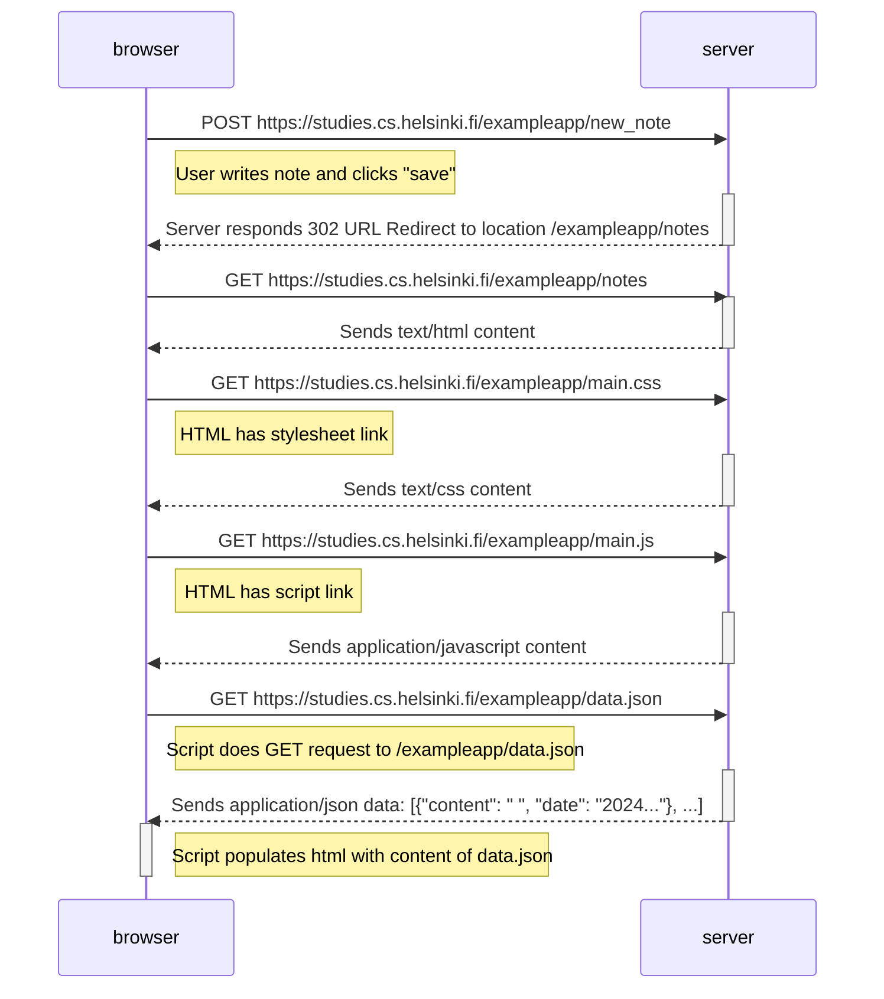

```mermaid
sequenceDiagram
    participant browser
    participant server

    browser->>server: POST https://studies.cs.helsinki.fi/exampleapp/new_note
    Note right of browser: User writes note and clicks "save"
    activate server
    server-->>browser: Server responds 302 URL Redirect to location /exampleapp/notes
    deactivate server

    browser->>server: GET https://studies.cs.helsinki.fi/exampleapp/notes
    activate server
    server-->>browser: Sends text/html content
    deactivate server

    browser->>server: GET https://studies.cs.helsinki.fi/exampleapp/main.css
    Note right of browser: HTML has stylesheet link
    activate server
    server-->>browser: Sends text/css content
    deactivate server

    browser->>server: GET https://studies.cs.helsinki.fi/exampleapp/main.js
    Note right of browser: HTML has script link
    activate server
    server-->>browser: Sends application/javascript content
    deactivate server

    browser->>server: GET https://studies.cs.helsinki.fi/exampleapp/data.json
    Note right of browser: Script does GET request to /exampleapp/data.json
    activate server
    server-->>browser: Sends application/json data: [{"content": " ", "date": "2024..."}, ...]
    deactivate server

    activate browser
    Note right of browser: Script populates html with content of data.json
    deactivate browser
```