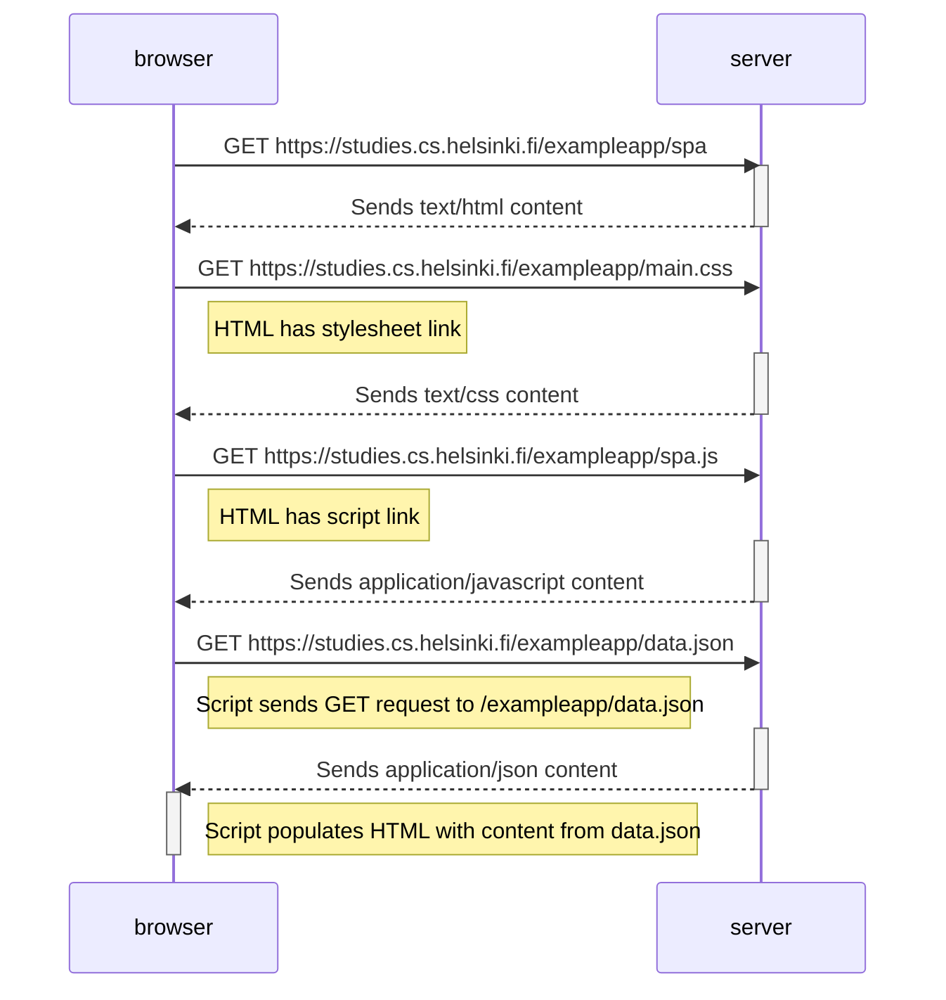

```mermaid
sequenceDiagram
    participant browser
    participant server

    browser->>server: GET https://studies.cs.helsinki.fi/exampleapp/spa
    activate server
    server-->>browser: Sends text/html content
    deactivate server

    browser->>server: GET https://studies.cs.helsinki.fi/exampleapp/main.css
    Note right of browser: HTML has stylesheet link
    activate server
    server-->>browser: Sends text/css content
    deactivate server

    browser->>server: GET https://studies.cs.helsinki.fi/exampleapp/spa.js
    Note right of browser: HTML has script link
    activate server
    server-->>browser: Sends application/javascript content
    deactivate server

    browser->>server: GET https://studies.cs.helsinki.fi/exampleapp/data.json
    Note right of browser: Script sends GET request to /exampleapp/data.json
    activate server
    server-->>browser: Sends application/json content
    deactivate server

    activate browser
    Note right of browser: Script populates HTML with content from data.json
    deactivate browser
```