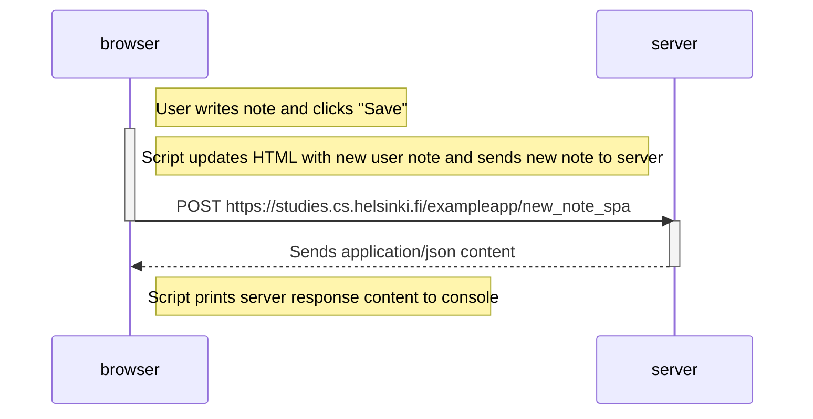

```mermaid
sequenceDiagram
    participant browser
    participant server

    
    Note right of browser: User writes note and clicks "Save"
    activate browser
    Note right of browser: Script updates HTML with new user note and sends new note to server
    browser->>server: POST https://studies.cs.helsinki.fi/exampleapp/new_note_spa
    deactivate browser
    activate server
    server-->>browser: Sends application/json content
    deactivate server
    Note right of browser: Script prints server response content to console
```