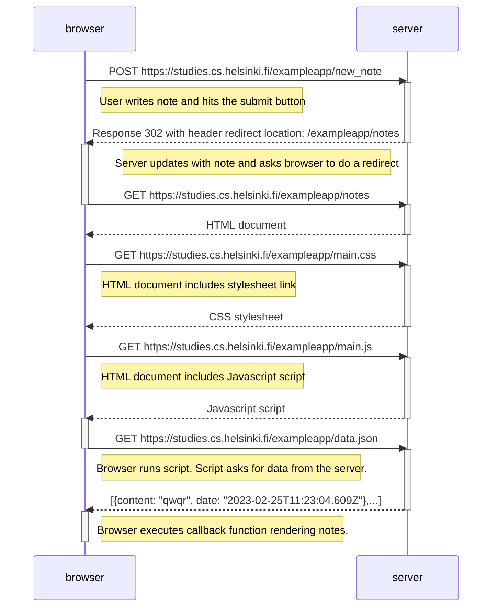

# Sequence Diagram for New Note

```mermaid
sequenceDiagram
    participant browser
    participant server
    
    browser->>server: POST https://studies.cs.helsinki.fi/exampleapp/new_note
    activate server
    Note right of browser: User writes note and hits the submit button

    server-->>browser: Response 302 with header redirect location: /exampleapp/notes
    deactivate server
    activate browser
    Note left of server: Server updates with note and asks browser to do a redirect

    browser->>server: GET https://studies.cs.helsinki.fi/exampleapp/notes
    deactivate browser
    activate server

    server-->>browser: HTML document
    deactivate server

    browser->>server: GET https://studies.cs.helsinki.fi/exampleapp/main.css
    activate server
    Note right of browser: HTML document includes stylesheet link

    server-->>browser: CSS stylesheet
    deactivate server

    browser->>server: GET https://studies.cs.helsinki.fi/exampleapp/main.js
    activate server
    Note right of browser: HTML document includes Javascript script

    server-->>browser: Javascript script
    deactivate server
    activate browser

    browser->>server: GET https://studies.cs.helsinki.fi/exampleapp/data.json
    deactivate browser
    activate server
    Note right of browser: Browser runs script. Script asks for data from the server.

    server-->>browser: [{content: "qwqr", date: "2023-02-25T11:23:04.609Z"},...]
    deactivate server
    activate browser
    Note right of browser: Browser executes callback function rendering notes.

    deactivate browser
```