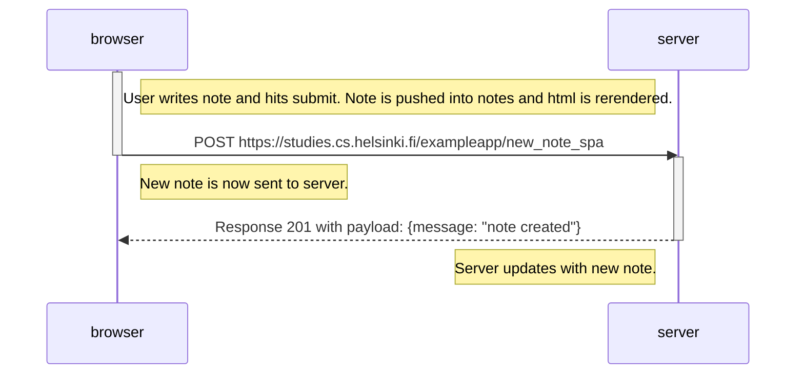

# Sequence Diagram for New Note on Single Page App

```mermaid
sequenceDiagram
    participant browser
    participant server

    activate browser
    Note right of browser: User writes note and hits submit. Note is pushed into notes and html is rerendered.

    browser->>server: POST https://studies.cs.helsinki.fi/exampleapp/new_note_spa
    deactivate browser
    activate server
    Note right of browser: New note is now sent to server.

    server-->>browser: Response 201 with payload: {message: "note created"}
    deactivate server
    Note left of server: Server updates with new note.
```