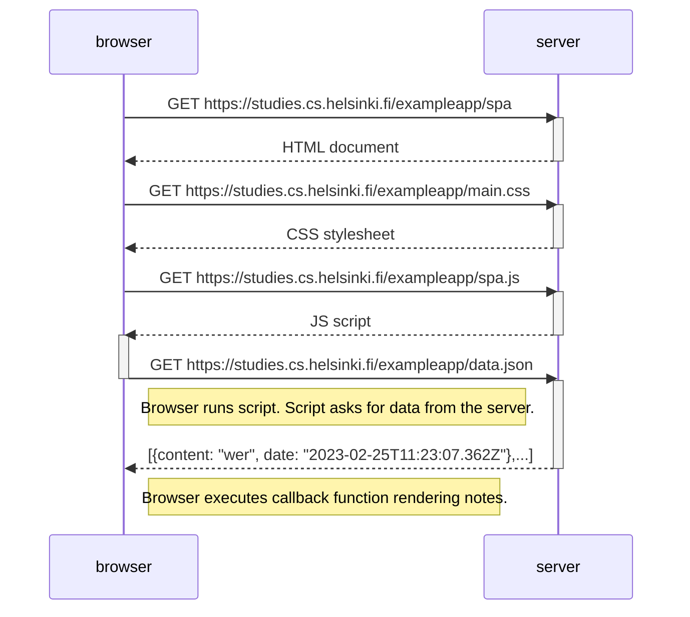

# Sequence Diagram for Single Page App

```mermaid
sequenceDiagram
    participant browser
    participant server

    browser->>server: GET https://studies.cs.helsinki.fi/exampleapp/spa
    activate server

    server-->>browser: HTML document
    deactivate server

    browser->>server: GET https://studies.cs.helsinki.fi/exampleapp/main.css
    activate server

    server-->>browser: CSS stylesheet
    deactivate server

    browser->>server: GET https://studies.cs.helsinki.fi/exampleapp/spa.js
    activate server

    server-->>browser: JS script
    deactivate server
    activate browser

    browser->>server: GET https://studies.cs.helsinki.fi/exampleapp/data.json
    deactivate browser
    activate server
    Note right of browser: Browser runs script. Script asks for data from the server.

    server-->>browser: [{content: "wer", date: "2023-02-25T11:23:07.362Z"},...]
    deactivate server
    activate browser
    Note right of browser: Browser executes callback function rendering notes.

```